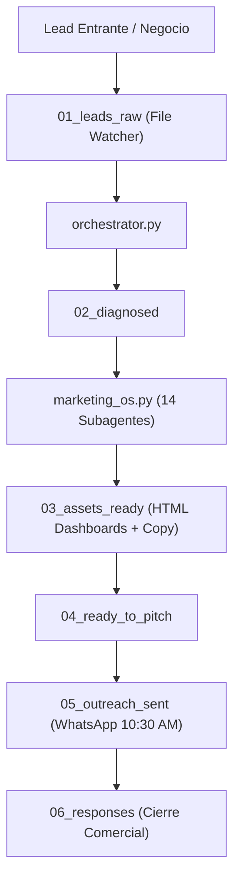

# ⚡ AI AGENCY MTY (`ai-agency`)
> **Infraestructura Multi-Agente Autónoma de Automatización, Rescate de WhatsApp y Monetización B2B.**  
> **Repositorio Oficial:** [https://github.com/ponchogf88/ai-agency](https://github.com/ponchogf88/ai-agency)  
> **Autor & Lead Engineer:** Jesús Alfonso Gutiérrez Flores  
> **Contacto:** WhatsApp Business: `+52 81 4005 0088` | Personal: `+52 81 3051 6527`  
> **Estado:** 🟢 Activo en Producción  

---

## 🏛️ 1. Visión General y Arquitectura

**AI AGENCY MTY** es una plataforma operativa autónoma diseñada para monetizar soluciones de automatización con inteligencia artificial en Monterrey y mercados globales. Combina 4 líneas de negocio de alto margen:

1. **Servicios Productizados B2B:** Auditorías de Rescate de Automatizaciones e implementación de agentes de WhatsApp para Clínicas, Despachos Jurídicos y Talleres Mecánicos ($150 USD a $550 USD / setup).
2. **Productos Digitales (Gumroad / LemonSqueezy):** Blueprints avanzados de **n8n** y **Make.com** listos para importar ($29 a $79 USD / venta).
3. **Marketplaces Freelance (Upwork / Fiverr):** Propuestas de alta conversión y catálogo de proyectos optimizados para captar clientes internacionales en USD.
4. **Experiencias Web 3D (Signal Universe Engine):** Portafolios de lujo para ejecutivos y marcas en Three.js + Cloudflare ($1,500 a $3,500 USD).



---

## 📁 2. Estructura de Directorios

```text
ai-agency/
├── 01_leads_raw/                      # Entrada de leads crudos (JSON o TXT)
├── 02_diagnosed/                      # Leads evaluados y diagnosticados
├── 03_assets_ready/                   # Paquetes completos por cliente (14 agentes + HTML)
│   ├── clinica-estetica-monterrey-norte_assets/
│   ├── despacho-juridico-mty_assets/
│   └── taller-mecanico-el-inge_assets/
├── 04_ready_to_pitch/                 # Material auditado listo para envío
├── 05_outreach_sent/                  # Registro de prospección enviada
├── 06_responses/                      # Respuestas y prospectos calificados
├── blueprints/                        # Workflows validados de n8n y Make.com
│   ├── n8n_whatsapp_smart_booking_router.json
│   ├── n8n_automated_cro_audit_engine.json
│   └── make_instant_payment_delivery_blueprint.json
├── products_packaged/                 # Productos digitales listos para Gumroad
│   ├── whatsapp_ai_lead_router/
│   ├── cro_speed_diagnostic_engine/
│   ├── stripe_mercadopago_fulfillment/
│   └── mega_agency_suite/
├── dist/                              # Archivos .zip compilados listos para distribución
├── marketplace_listings/              # Fichas publicables para Upwork y Fiverr
├── swarms/                            # Entregables de los 9 subagentes de ejecución
│   ├── enjambre_a_b2b/                # Bases de leads CSV y copys de WhatsApp
│   ├── enjambre_b_gumroad/            # Prompts visuales, manifiesto JSON y lead magnet
│   └── enjambre_c_marketplaces/       # Propuestas de Upwork y contrato marco legal SLA
├── portal/                            # Portal comercial interactivo con simulador de ROI
│   ├── index.html                     # Landing page oscura ultra-rápida
│   ├── worker.js                      # Router de Cloudflare Worker
│   └── wrangler.toml                  # Configuración de despliegue
├── notion_export/                     # Exportación estructurada para Notion
│   ├── AI_AGENCY_MTY_NOTION_PAGE.md
│   └── NOTION_DATABASE_OPPORTUNITIES.csv
├── marketing_os.py                    # Motor de 14 agentes especializados
├── builder.py                         # Compilador de assets por cliente
├── orchestrator.py                    # Pipeline de automatización con watchdog
├── inject_whatsapp.py                 # Inyector de teléfonos comerciales
├── run_swarms.py                      # Ejecutor del enjambre de 9 subagentes
├── sync_to_obsidian.py                # Sincronizador con Obsidian Vault
└── sync_to_notion.py                  # Sincronizador con API de Notion
```

---

## 🛠️ 3. Comandos Principales

### Iniciar el Pipeline Watchdog Autónomo
```bash
python3 orchestrator.py
```

### Ejecutar los 14 Agentes de Marketing OS para un Lead
```bash
python3 marketing_os.py --target "Nombre del Cliente" --niche "Nicho" --type "lead"
```

### Inyectar Nuevo Teléfono en Portales y Secuencias
```bash
python3 inject_whatsapp.py --phone 5218140050088
```

### Empaquetar Productos Digitales en `.zip`
```bash
python3 build_store_packages.py
```

### Sincronizar Todo a Obsidian y Notion
```bash
python3 sync_to_obsidian.py
python3 sync_to_notion.py
```

---

## 🔒 4. Seguridad, Datos y Legalidad

- **Blindaje Legal:** Contrato de prestación de servicios y SLA incluido en [`swarms/enjambre_c_marketplaces/contrato_prestacion_servicios_ia.md`](file:///Users/user/agencia-core/swarms/enjambre_c_marketplaces/contrato_prestacion_servicios_ia.md).
- **Protección de Datos:** Apego a la Ley Federal de Protección de Datos Personales en Posesión de los Particulares (LFPDPPP). Todos los datos pertenecen 100% al cliente.

© 2026 AI AGENCY MTY • Gutierrez Consulting • Monterrey, N.L., México.
